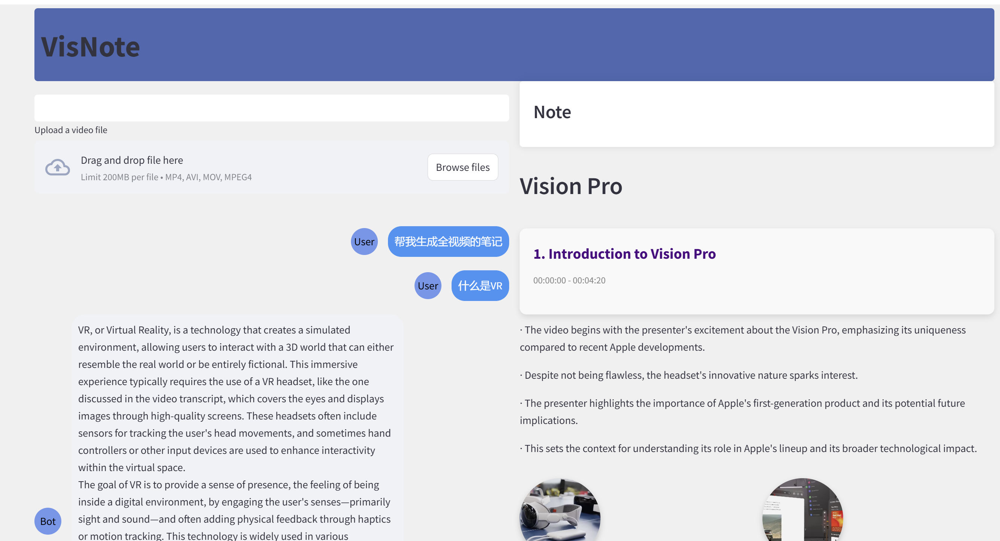
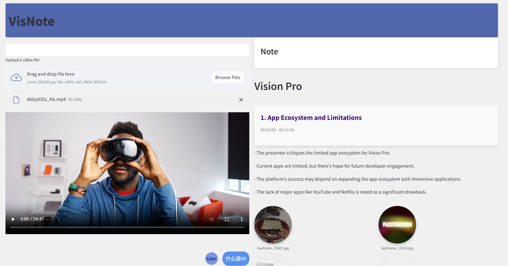

## `VideoNote`

### `app`主要功能

#### **1. AI自动生成视频笔记**（右边区域）

+ **基于用户需求个性化生成笔记**
+ **笔记样式的多样化**

- **视频内容的理解划分**：视频会根据内容的变化，分割成若干个时间段。会自动根据视频的转录文本和内容变化，识别出内容的转折点，并将其划分为逻辑上连贯的时间段。
- **视频内容的总结**：为每个时间段生成简洁、准确的总结。每个摘要会突出该时间段的关键内容，并且会用简洁的话语进行表达
- **关键帧图像与视频内容关联**：每个视频段落的摘要会与相关的关键帧图像进行关联。
- **词云生成**：根据视频内容中出现频率较高的关键词生成词云。
- **关键图像的背景去除**

#### **2. 视频问答功能**（左边区域）

- **基于转录文本的自动问答**：系统从视频的转录文本中提取关键内容，当用户提出问题时，系统会快速识别问题与视频文本中的相关部分，并提供回答。
- **智能补充知识**：在某些情况下，视频的内容可能无法完全回答用户的问题。此时，会通过引入相关的背景信息、常识或其他相关内容来补充。
- **交互性**：该功能支持用户与视频内容进行互动，用户可以提出更精确或更具挑战性的问题，系统则根据视频中的具体内容进行调整和回答。


##### 效果图展示






运行前请确保你的环境匹配，并请自行更换`API-KEY `和`API-BASE`


运行顺序

```python
python KeyFrameExtract.py
python deleteSomePic.py
streamlit run app.py
```

