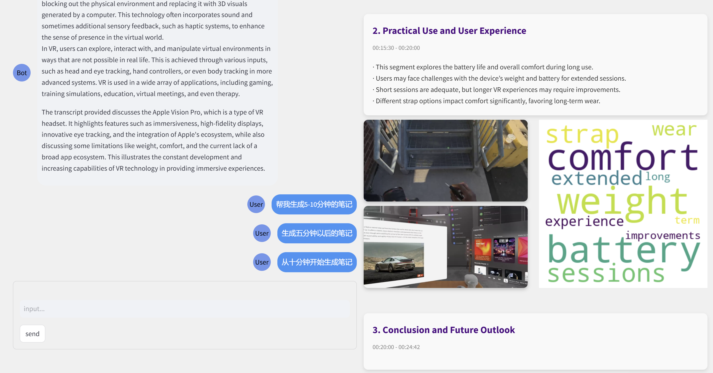

# VideoNote

### 主要功能
本项目采用streamlit搭建，实现了个性化AI生成视频笔记。

#### 1. AI自动生成视频笔记（右边区域）

- 基于用户需求个性化生成笔记
- 视频内容的理解划分与总结
- 关键帧图像与视频内容关联
- 关键图像的背景去除
- 笔记样式的多样化
- 词云生成

#### 2. 视频问答功能（左边区域）

- 基于视频内容的自动问答
- 智能补充知识


### 项目依赖技术
背景去除技术:RMBG-1.4

使用的预训练大模型:chatgpt-4o

图像特征提取技术:ResNet50

关键帧生成使用的聚类技术:DBSCAN

### 启动项目
运行前请确保你的环境匹配，并请自行更换`API-KEY `和`API-BASE`

注意：需要的API有
> openai的api
>
> huggingface的api

运行顺序
```bash
python datapre\KeyFrameExtract.py
python datapre\deleteSomePic.py
streamlit run app.py
```

### 使用效果





